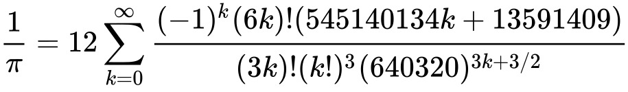
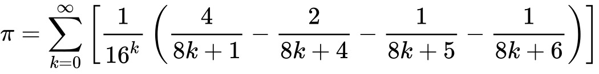
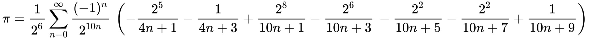

# Pi Calculator

## Abstract

This report explores the implementation of Bailey-Borwein-Plouffe (BBP) formula to calculate the value of Pi in Java.
Bellard's algorithm is an efficient method for computing Pi, offering faster convergence than many traditional algorithms.
The implementation details, mathematical background, and performance considerations are discussed.

## Intro

PI as one of the most influential irrational numbers in vast world of mathematics.
In basic education - mostly in geometry - we've been taught to define PI as circle's number ration to its radius.
finding the most accurate PI number's been a classic math problem and issue for scientist since 15th century and earlier.

## Algorithms

### 

### Random coordination
we can create random points coordination and see if they are within the circle X^2 + Y^2 = 1 ,theoretically in large number of repeating this method 
we can calculate Pi number . the catch is for 1000 digits after decimal point we need a really large number of random points and it is not efficient
because of the lack of time .
And by way, we can't trust "random"! there is NO random.

### Nilkantha's series

The series was published in the 15th century by the Indian mathematician Nilakantha Somayaji. 
It's the first accessible algorithm when it comes to finding one.
We should consider it a classic algorithm with time complexity of O(N * logN * loglogN)
    
> Approach: 
When looking at the pattern of the denominator, we can see that, except for the first term, each term consists of the product of three sequential numbers.
To find the right term in the denominator, we can use a variable and increase it by two with each iteration.
Also, note that this is an alternating series, meaning the signs of consecutive terms are different.

### Ramanujan–Sato series

Examples for levels 1–4 were given by Ramanujan in his 1917 paper.
It's been basis of many other modern algorithms.

### Chudnovsky series

The Chudnovsky algorithm is a fast method for calculating the digits of π, based on Ramanujan's π formulae.
Published by the Chudnovsky brothers in 1988, it was used to calculate π to a billion decimal places.
The order of the algorithm is O(N * logN ^ 3).

### Bailey-Borwein-Plouffe series

Such algorithms are called spigot algorithms.
The formula was discovered experimentally in 1995 via the PSLQ algorithm, which itself was named one of the Top Ten Algorithms of the Century.

I actualy choosed this one because its easy to implement

### Bellard's formula

Bellard's formula was discovered by Fabrice Bellard in 1997. It is about 43% faster than the Bailey–Borwein–Plouffe formula (discovered in 1995).
It has been used in PiHex, the now-completed distributed computing project.

> One important use of this method is to confirm calculations of all the numbers in pi that have been done using other methods.
Instead of having to calculate all the numbers in pi twice using two different algorithms to make sure the calculation is accurate, the final numbers in a very long calculation can be checked using Bellard's formula, which is much faster.

## Bugs and Challenges

- The first thing to mention as challenge is working with large numbers with BigDecimal.
Doing operations with BigDecimal methods could be tricky for a while.

- Defining PI as static attribute could lead to false result in running multiple test cases. ****
Everyone. Running test cases separately is a way to solve the problem.

- Rounding mode argument and count of digits after floating point was making trouble.
There's big difference between different counts.

## Performance Considerations

- Precision: The MathContext class is used to maintain precision.

- Efficiency: Bailey-Borwein-Plouffe method is designed for efficiency, but calculating a large number of digits requires significant computational resources.

- Memory Usage: Arbitrary-precision arithmetic consumes substantial memory, especially for a high number of decimal places.

## Conclusion

Bailey-Borwein-Plouffe method provides an efficient way to compute Pi to a large number of decimal places.
The Java implementation leverages the BigDecimal class to handle the precision required for such calculations.
This report demonstrates the mathematical foundation and practical implementation details necessary for computing Pi using this algorithm.

